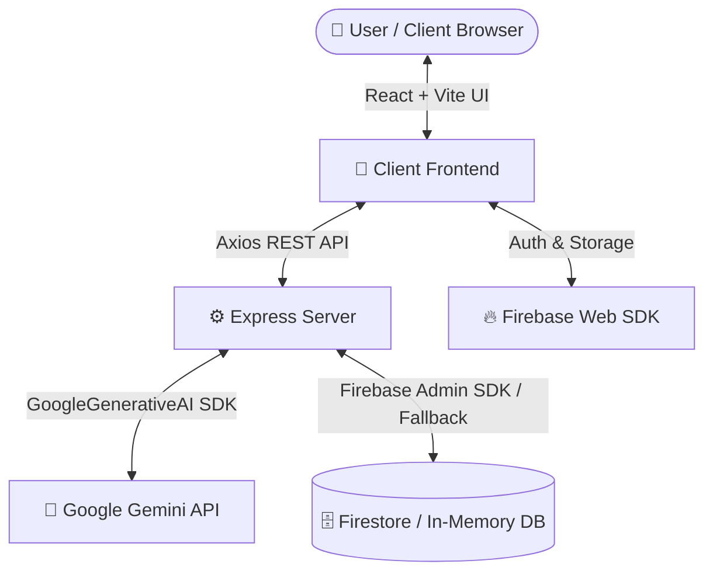

# 🚀 DeadlineAI – AI Productivity Companion

> **The Last-Minute Life Saver**  
> A production-ready, full-stack AI-powered productivity companion built for hackathons to proactively help users plan, prioritize, breakdown, and complete tasks before deadlines are missed.
> 🔗 **Live Demo:** [https://wondrous-bienenstitch-43d846.netlify.app/](https://wondrous-bienenstitch-43d846.netlify.app/)

[](https://react.dev/)
[](https://tailwindcss.com/)
[](https://nodejs.org/)
[](https://deepmind.google/technologies/gemini/)
[](https://firebase.google.com/)
[](https://wondrous-bienenstitch-43d846.netlify.app)

---

## 📖 Table of Contents
- [✨ Key Features](#-key-features)
- [🏗️ System Architecture](#️-system-architecture)
- [🛠️ Tech Stack](#️-tech-stack)
- [📂 Folder Structure](#-folder-structure)
- [🚀 Quick Start & Local Execution](#-quick-start--local-execution)
- [🔌 API Routes Documentation](#-api-routes-documentation)
- [🗄️ Database Schemas](#️-database-schemas)
- [☁️ Deployment Guide (Google Cloud & Firebase)](#️-deployment-guide-google-cloud--firebase)
- [📝 License](#-license)

---

## ✨ Key Features

- **🛡️ Authentication**: User Registration, Login, Google Sign-In, and Protected Routes.
- **📊 Modern SaaS Dashboard**: Real-time task completion rate, productivity score gauge (0-100), active streaks, closest deadline warnings, and proactive AI notifications.
- **📝 Smart Task Management**: Full CRUD capabilities with categories (*Personal, College, Work, Health, Finance, Projects*) and priority levels (*Low, Medium, High, Critical*).
- **🤖 Gemini AI Task Breakdown**: Deconstructs complex tasks into micro-subtasks, estimated completion durations, optimal working hours, and energy breaks.
- **📅 AI Daily Planner**: Automated daily schedule optimizer creating focus sessions and break slots starting from your current local time.
- **💬 AI Coach & Voice Assistant**: Mentorship chatbot powered by Gemini with integrated Speech-to-Text (`SpeechRecognition`) for voice commands.
- **📈 Analytics & Gamification**: Recharts visualizations for category allocations, weekly output trends, streak trackers, and unlockable achievement badges.
- **⏱️ Pomodoro Focus Mode**: Ambient distraction-free timer with deep-work intervals and celebration confetti.
- **📆 Google Calendar Sync**: One-click integration hook to align task deadlines with external Google Calendar events.

---

## 🏗️ System Architecture



---

## 🛠️ Tech Stack

### Frontend
- **Core**: React 18, Vite
- **Styling**: Tailwind CSS v4, Glassmorphism design system
- **Animations & FX**: Framer Motion, Canvas Confetti
- **Icons & Charts**: Lucide Icons / React Icons, Recharts
- **State & Routing**: React Context API (`AuthContext`, `TaskContext`, `ThemeContext`), React Router v6

### Backend
- **Environment**: Node.js, Express.js
- **AI Engine**: `@google/generative-ai` (`gemini-1.5-flash`)
- **Database / Auth**: Firebase Admin SDK with dual-mode in-memory fallback
- **Security**: JWT (`jsonwebtoken`), CORS, dotenv

---

## 📂 Folder Structure

```
c:/ai-productivity companion/
├── client/
│   ├── src/
│   │   ├── assets/
│   │   ├── components/       # Reusable UI (TaskModal, AIBreakdownModal, LoadingSkeleton)
│   │   ├── context/          # AuthContext, TaskContext, ThemeContext
│   │   ├── firebase/         # Web SDK config
│   │   ├── hooks/            # Custom React hooks
│   │   ├── layouts/          # MainLayout (Sidebar, Header, Smart Notification Banner)
│   │   ├── pages/            # Dashboard, TaskManager, DailyPlanner, AICoach, Analytics, Focus
│   │   ├── services/         # Axios API client setup
│   │   └── utils/
│   ├── package.json
│   └── vite.config.js
├── server/
│   ├── config/               # Environment variable loader
│   ├── controllers/          # authController, taskController, aiController, analyticsController
│   ├── firebase/             # firebaseAdmin setup & mock DB store
│   ├── middleware/           # verifyAuth middleware
│   ├── routes/               # authRoutes, taskRoutes, aiRoutes, analyticsRoutes
│   ├── services/             # geminiService, calendarService
│   ├── Dockerfile            # Cloud Run container definition
│   ├── package.json
│   └── server.js             # Main Express entrypoint
├── firebase.json             # Firebase Hosting config
└── README.md
```

---

## 🚀 Quick Start & Local Execution

### Prerequisites
- Node.js (v18 or higher)
- npm

### 1. Backend Setup (`server/`)
```bash
cd server
npm install
```

Create a `.env` file inside `server/`:
```env
PORT=5000
JWT_SECRET=deadline_ai_super_secret_jwt_key_2026
GEMINI_API_KEY=your_gemini_api_key_here
FIREBASE_PROJECT_ID=deadline-ai-dev
```

Launch the backend server:
```bash
npm run dev
# Express server running on http://localhost:5000
```

### 2. Frontend Setup (`client/`)
In a new terminal window:
```bash
cd client
npm install
npm run dev
# Vite application running on http://localhost:3000
```

---

## 🔌 API Routes Documentation

| Method | Endpoint | Description |
| :--- | :--- | :--- |
| `POST` | `/api/register` | Register new user |
| `POST` | `/api/login` | Authenticate user & return JWT |
| `POST` | `/api/logout` | End session |
| `GET` | `/api/tasks` | Fetch user's tasks |
| `POST` | `/api/tasks` | Create new task |
| `PUT` | `/api/tasks/:id` | Update existing task |
| `DELETE` | `/api/tasks/:id` | Delete task |
| `POST` | `/api/tasks/sync-calendar` | Synchronize tasks with Google Calendar |
| `POST` | `/api/ai/generate-plan` | Generate Gemini step-by-step task breakdown |
| `POST` | `/api/ai/daily-plan` | Generate optimized daily schedule timeline |
| `POST` | `/api/ai/chat` | AI Productivity Coach conversation endpoint |
| `GET` | `/api/analytics` | Fetch productivity metrics, streaks, and badges |

---

## 🗄️ Database Schemas

### Users Collection
```json
{
  "uid": "user_123",
  "name": "Alex Vance",
  "email": "alex@deadline.ai",
  "photo": "https://api.dicebear.com/7.x/avataaars/svg?seed=Alex",
  "createdAt": "2026-06-29T09:00:00Z"
}
```

### Tasks Collection
```json
{
  "id": "task_demo_1",
  "userId": "user_123",
  "title": "Complete OS Assignment 3",
  "description": "Implement page replacement algorithms in C++",
  "deadline": "2026-06-30T23:59:00Z",
  "priority": "Critical",
  "estimatedHours": 4,
  "status": "pending",
  "category": "College",
  "createdAt": "2026-06-29T09:00:00Z"
}
```

---

## ☁️ Deployment Guide (Google Cloud & Firebase)

### Deploy Backend on Google Cloud Run
```bash
cd server
gcloud builds submit --tag gcr.io/YOUR_GCP_PROJECT_ID/deadline-ai-server
gcloud run deploy deadline-ai-server \
  --image gcr.io/YOUR_GCP_PROJECT_ID/deadline-ai-server \
  --platform managed \
  --region us-central1 \
  --allow-unauthenticated \
  --set-env-vars GEMINI_API_KEY=your_key,JWT_SECRET=your_secret
```

### Deploy Frontend on Firebase Hosting
```bash
cd client
npm run build
cd ..
firebase deploy --only hosting
```

### Deploy Frontend on Netlify
To deploy the frontend to Netlify:
1. Make sure `client/public/_redirects` is created with `/* /index.html 200` to support React Router SPA redirection.
2. Build the application:
   ```bash
   cd client
   npm run build
   ```
3. Deploy via Netlify CLI:
   ```bash
   npx netlify deploy --dir=client/dist --prod
   ```
   *Or link your GitHub repository to Netlify and configure the build command as `npm run build` and publish directory as `client/dist`.*

---

## 📝 License
Distributed under the MIT License. Built with ❤️ for Hackathons.
"# deadlineai-productivity" 

